# VietSupply Radar Current Demo Diagrams

This document captures the demo that is currently implemented in the repository. It covers the activity flows, OOP surface, database model and system backbone used by the React + FastAPI + SQLite demo.

Editable draw.io version: [VietSupply_Radar_Current_Demo_Backbone.drawio](diagrams/VietSupply_Radar_Current_Demo_Backbone.drawio)

## Demo Activity 0 - App Bootstrap And Overview

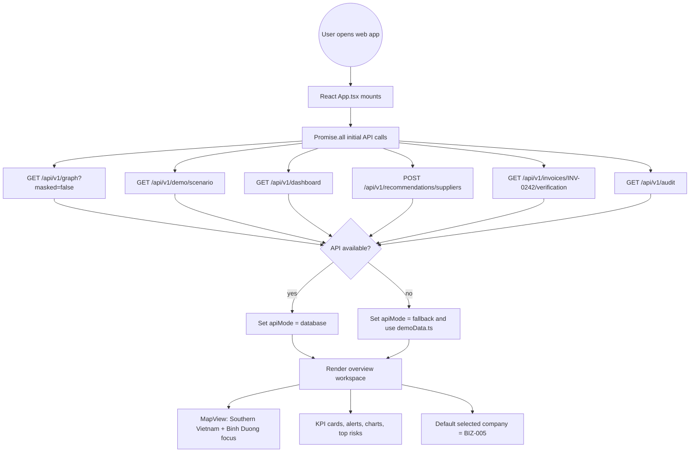

## Demo Activity 1 - Node Selection, Evidence Vault And Risk Signal

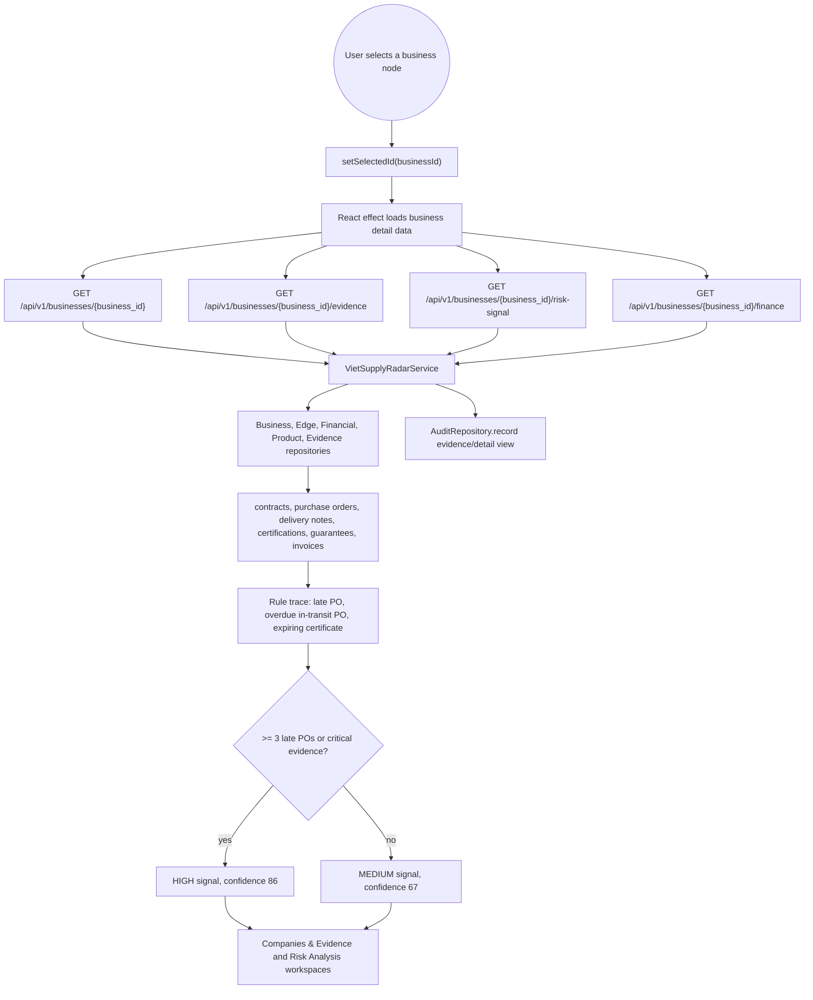

## Demo Activity 2 - Supply Shock Simulation

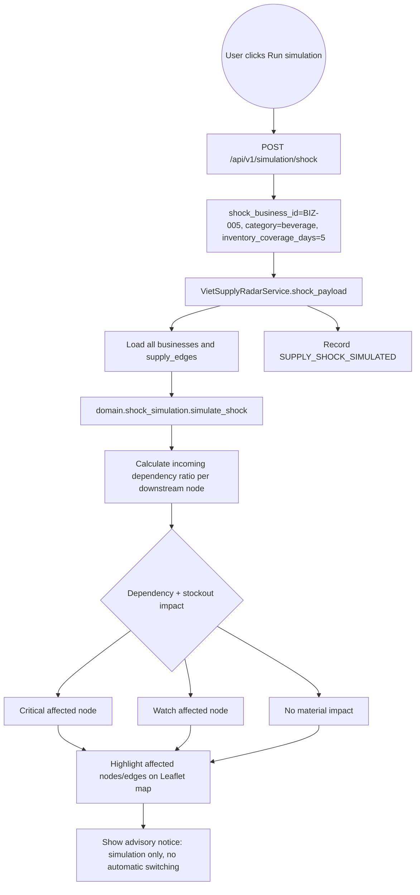

## Demo Activity 3 - Supplier Matching And Human Introduction Request

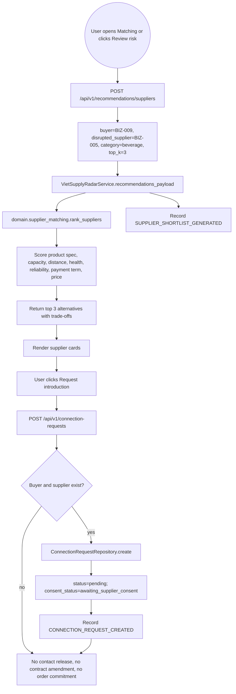

## Demo Activity 4 - Financial Health And Invoice Verification

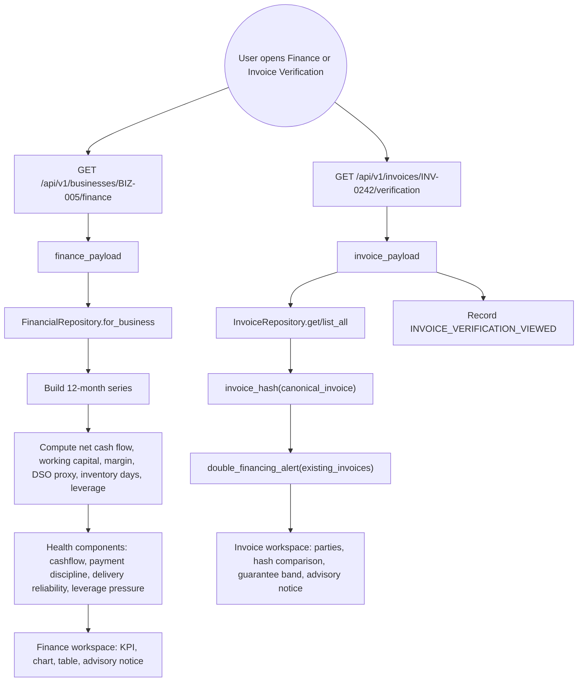

## Demo Activity 5 - Audit And Governance Backbone

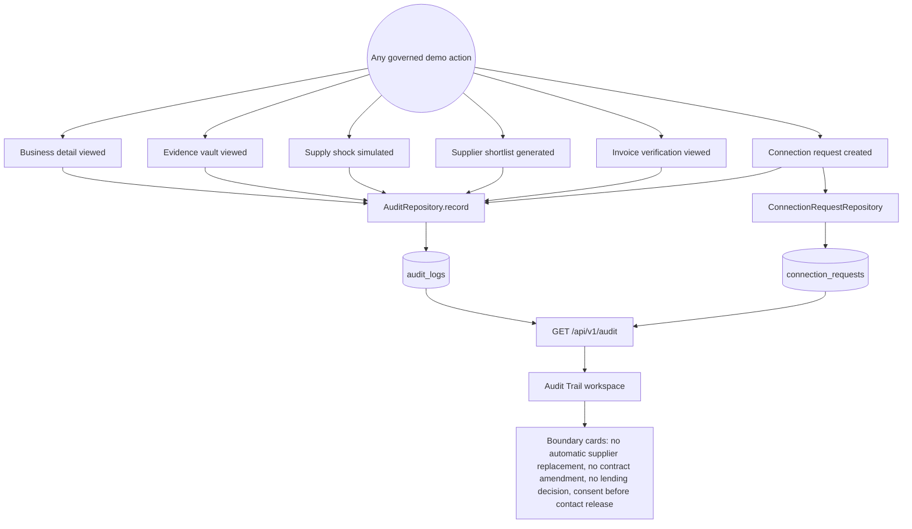

## Backbone Architecture

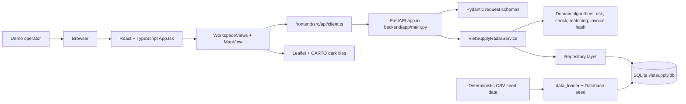

## OOP Domain Classes

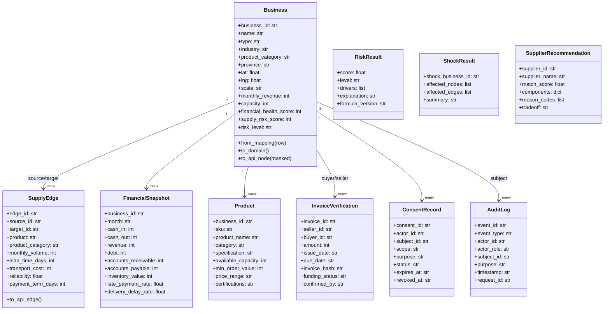

## OOP Service And Repository Classes

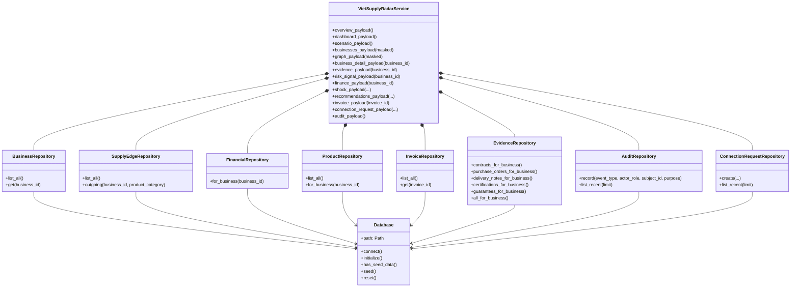

## Database ERD

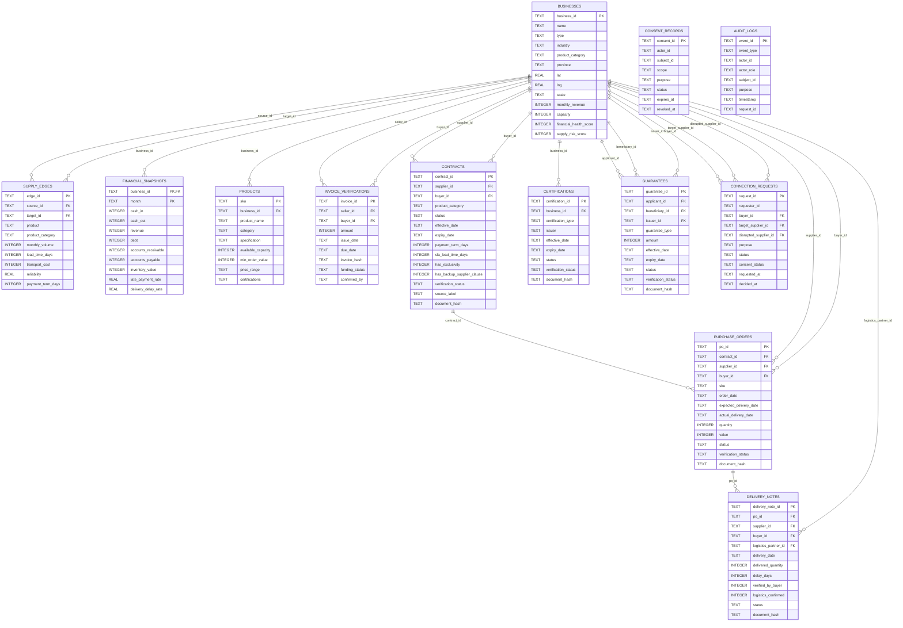

## API Surface

```mermaid
flowchart TD
    FastAPI["backend/app/main.py"]
    Health["GET /api/v1/health"]
    Overview["GET /api/v1/overview"]
    Dashboard["GET /api/v1/dashboard"]
    Scenario["GET /api/v1/demo/scenario"]
    Businesses["GET /api/v1/businesses"]
    BusinessDetail["GET /api/v1/businesses/{id}"]
    Evidence["GET /api/v1/businesses/{id}/evidence"]
    Risk["GET /api/v1/businesses/{id}/risk-signal"]
    Finance["GET /api/v1/businesses/{id}/finance"]
    Graph["GET /api/v1/graph"]
    Shock["POST /api/v1/simulation/shock"]
    Recs["POST /api/v1/recommendations/suppliers"]
    Invoice["GET /api/v1/invoices/{id}/verification"]
    Request["POST /api/v1/connection-requests"]
    Audit["GET /api/v1/audit"]
    Service["VietSupplyRadarService"]

    FastAPI --> Health
    FastAPI --> Overview
    FastAPI --> Dashboard
    FastAPI --> Scenario
    FastAPI --> Businesses
    FastAPI --> BusinessDetail
    FastAPI --> Evidence
    FastAPI --> Risk
    FastAPI --> Finance
    FastAPI --> Graph
    FastAPI --> Shock
    FastAPI --> Recs
    FastAPI --> Invoice
    FastAPI --> Request
    FastAPI --> Audit
    Health --> Service
    Overview --> Service
    Dashboard --> Service
    Scenario --> Service
    Businesses --> Service
    BusinessDetail --> Service
    Evidence --> Service
    Risk --> Service
    Finance --> Service
    Graph --> Service
    Shock --> Service
    Recs --> Service
    Invoice --> Service
    Request --> Service
    Audit --> Service
```
